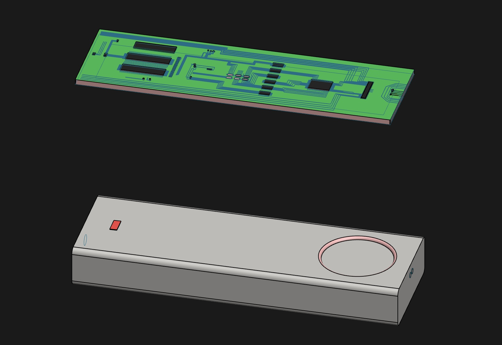

# THIS REPOSITORY IS UNDER MAINTAINANCE
## Morse Code Data Transmission and Storage Device



## Table of Contents
- [Introduction](#introduction)
- [Features](#features)
- [Usage](#usage)
- [Installation](#installation)
- [Configuration](#configuration)
- [Contributing](#contributing)
- [License](#license)

## Introduction

The Morse Code Data Transmission and Storage Device is a cutting-edge solution for encoding, transmitting, and storing data using Morse Code. This device combines the efficiency and simplicity of Morse Code with advanced technologies to provide a versatile tool for secure and reliable data communication.

## Features

- **Morse Code Encoding:** Efficiently encode data into Morse Code for transmission.
- **Wireless Transmission:** Transmit Morse Code signals wirelessly for communication.
- **Data Storage:** Store Morse Code-encoded data securely on the device.
- **User-friendly Interface:** Intuitive interface for easy interaction and configuration.
- **High-Speed Transmission:** Utilize advanced algorithms for high-speed data transmission.

## Usage

1. **Power On:** Turn on the device using the power button.
2. **Input Data:** Enter the data using the device's input interface.
3. **Encode:** Utilize the device to encode data into Morse Code.
4. **Transmit:** Transmit Morse Code signals wirelessly to the intended recipient.
5. **Store:** Securely store Morse Code-encoded data on the device for future reference.

## Installation

To use the Morse Code Data Transmission and Storage Device, follow these installation steps:

1. **Clone Repository:**
    ```bash
    git clone https://github.com/harshittiwariii/Morse-code-based-data-transmission-and-storage.git
    ```

2. **Navigate to Repository:**
    ```bash
    cd morse-code-device
    ```

3. **Install Dependencies:**
    ```bash
    npm install
    ```

4. **Run Application:**
    ```bash
    npm start
    ```

## Configuration

The device can be configured for specific use cases. Modify the configuration file `config.json` to customize settings such as transmission speed, encoding algorithms, and more.

Example `config.json`:
```json
{
  "transmissionSpeed": "high",
  "encodingAlgorithm": "advanced",
  "language": "English"
}
